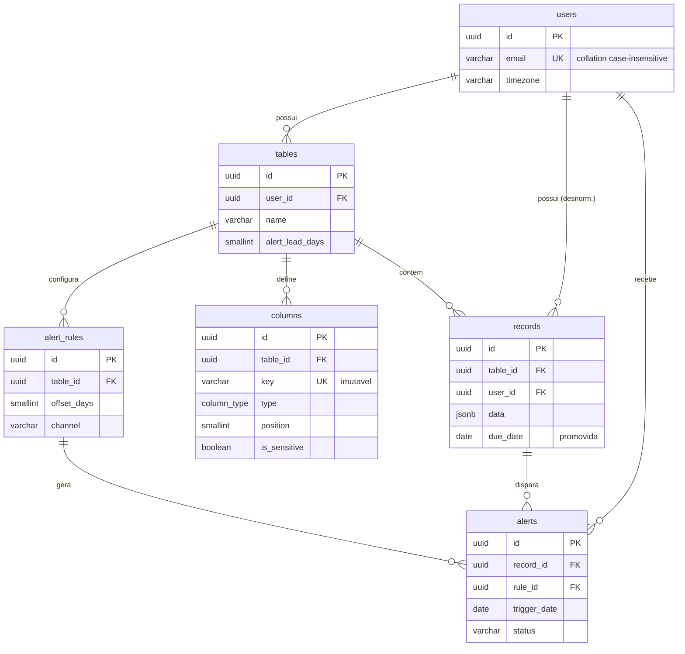

# Modelo de dados — remind-task

**Status:** vigente
**Última revisão:** 2026-08-19
**Banco:** PostgreSQL 16

Documento vivo. Toda mudança de schema atualiza este arquivo na mesma alteração.

---

## Decisão central: JSONB híbrido, não EAV puro

A [especificação](especificacao.md#6-modelo-conceitual-original) sugere `RecordValue(record_id, column_id, value)` — EAV clássico. **Rejeitado.**

| Problema do EAV | Impacto nos requisitos |
|---|---|
| N linhas por registro; listar 50 registros de 6 colunas = 300 linhas + pivot | RF04, RF11 viram consulta cara e complexa |
| `value` é `TEXT` → ordenar por data exige cast por linha, sem índice útil | RF11 fica O(n) sem índice |
| Varrer vencimentos exige join + filtro em `value` textual | RF12 (job periódico) fica lento e frágil |
| Export precisa pivotar em SQL ou em Python | RF13 vira N+1 |

**Adotado:** `records.data JSONB` (uma linha por registro) **+ colunas promovidas** para o que o sistema precisa consultar (`due_date`). Flexibilidade do EAV, performance de coluna nativa nos dois pontos quentes: ordenação e varredura de alertas.

Chave do JSONB = `columns.key` — slug **imutável** gerado na criação da coluna. Não `columns.id` (ilegível) e não `columns.name` (mutável). Renomear a coluna (RF05) não reescreve nenhum registro.

---

## DDL

```sql
-- =========================================================
-- accounts                                    [implementado — Phase 1]
-- =========================================================

-- Comparação case-insensitive sem CITEXT: as classes CIText/CIEmailField do
-- django.contrib.postgres foram REMOVIDAS no Django 5.1, e a substituição
-- oficial é uma collation não-determinística.
--   und-u-ks-level2 = ignora caixa, respeita acento.
-- Criada em accounts/migrations/0001_initial.py via CreateCollation.
CREATE COLLATION case_insensitive (
    provider = icu, locale = 'und-u-ks-level2', deterministic = false
);

CREATE TABLE users (
    id            UUID PRIMARY KEY DEFAULT gen_random_uuid(),
    email         VARCHAR(254) COLLATE case_insensitive NOT NULL UNIQUE,  -- USERNAME_FIELD
    name          VARCHAR(120) NOT NULL,
    password      VARCHAR(128) NOT NULL,             -- argon2id
    timezone      VARCHAR(64)  NOT NULL DEFAULT 'America/Sao_Paulo',
    is_active     BOOLEAN      NOT NULL DEFAULT TRUE,
    is_staff      BOOLEAN      NOT NULL DEFAULT FALSE,
    is_superuser  BOOLEAN      NOT NULL DEFAULT FALSE,
    last_login    TIMESTAMPTZ,
    created_at    TIMESTAMPTZ  NOT NULL DEFAULT now(),
    updated_at    TIMESTAMPTZ  NOT NULL DEFAULT now()
);
-- O UNIQUE herda a collation da coluna: ana@x.com e Ana@X.com colidem no banco,
-- não só no serializer. Coberto por
-- test_duplicate_email_is_blocked_by_the_database_case_insensitively.

-- =========================================================
-- tables
-- =========================================================
CREATE TABLE tables (
    id               UUID PRIMARY KEY DEFAULT gen_random_uuid(),
    user_id          UUID NOT NULL REFERENCES users(id) ON DELETE CASCADE,
    name             VARCHAR(120) NOT NULL,
    description      TEXT NOT NULL DEFAULT '',
    alert_lead_days  SMALLINT NOT NULL DEFAULT 3
                       CHECK (alert_lead_days BETWEEN 0 AND 365),
    created_at       TIMESTAMPTZ NOT NULL DEFAULT now(),
    updated_at       TIMESTAMPTZ NOT NULL DEFAULT now(),
    CONSTRAINT tables_unique_name_per_user UNIQUE (user_id, name)
);
CREATE INDEX tables_user_created_idx ON tables (user_id, created_at DESC);

-- =========================================================
-- columns                                     [implementado — Phase 2]
-- =========================================================

-- `type` é varchar + CHECK, NÃO um ENUM nativo do Postgres.
-- Acrescentar um tipo novo (RF05 prevê evolução) aqui é uma migration de
-- constraint comum. Num ENUM nativo seria `ALTER TYPE ... ADD VALUE`, que não
-- roda dentro de transação e não tem reversão — migration irreversível por um
-- ganho de bytes que não faz falta.

CREATE TABLE columns (
    id           UUID PRIMARY KEY DEFAULT gen_random_uuid(),
    table_id     UUID NOT NULL REFERENCES tables(id) ON DELETE CASCADE,
    key          VARCHAR(64) NOT NULL,            -- slug IMUTÁVEL; chave em records.data
    name         VARCHAR(80) NOT NULL,            -- rótulo mutável
    type         VARCHAR(16) NOT NULL
                   CHECK (type IN ('text','number','date','datetime',
                                   'boolean','email','select','due_date')),
    position     SMALLINT NOT NULL,
    is_required  BOOLEAN NOT NULL DEFAULT FALSE,
    is_sensitive BOOLEAN NOT NULL DEFAULT FALSE,  -- RS05
    options      JSONB   NOT NULL DEFAULT '[]',   -- choices de 'select'
    created_at   TIMESTAMPTZ NOT NULL DEFAULT now(),
    updated_at   TIMESTAMPTZ NOT NULL DEFAULT now(),
    CONSTRAINT columns_unique_key      UNIQUE (table_id, key),
    CONSTRAINT columns_unique_position UNIQUE (table_id, position) DEFERRABLE INITIALLY DEFERRED,
    CONSTRAINT columns_select_has_options
        CHECK (type <> 'select' OR jsonb_array_length(options) > 0)
);
CREATE UNIQUE INDEX columns_one_due_date_per_table
    ON columns (table_id) WHERE type = 'due_date';       -- RF06

-- =========================================================
-- records
-- =========================================================
CREATE TABLE records (                       -- [implementado — Phase 3]
    id          UUID PRIMARY KEY DEFAULT gen_random_uuid(),
    table_id    UUID NOT NULL REFERENCES tables(id) ON DELETE CASCADE,
    user_id     UUID NOT NULL REFERENCES users(id)  ON DELETE CASCADE,  -- nota 1
    data        JSONB NOT NULL DEFAULT '{}',
    due_date    DATE,                                                   -- nota 2
    position    INTEGER,
    created_at  TIMESTAMPTZ NOT NULL DEFAULT now(),
    updated_at  TIMESTAMPTZ NOT NULL DEFAULT now(),
    CONSTRAINT records_data_is_object CHECK (jsonb_typeof(data) = 'object')
);
CREATE INDEX records_table_due_idx ON records (table_id, due_date ASC NULLS LAST);
CREATE INDEX records_due_scan_idx  ON records (due_date) WHERE due_date IS NOT NULL;
CREATE INDEX records_data_gin      ON records USING GIN (data jsonb_path_ops);

-- =========================================================
-- alert_rules                                 [implementado — Phase 5]
-- =========================================================
CREATE TABLE alert_rules (
    id           UUID PRIMARY KEY DEFAULT gen_random_uuid(),
    table_id     UUID NOT NULL REFERENCES tables(id) ON DELETE CASCADE,
    user_id      UUID NOT NULL REFERENCES users(id)  ON DELETE CASCADE,
    offset_days  SMALLINT NOT NULL CHECK (offset_days BETWEEN -365 AND 365),
    channel      VARCHAR(16) NOT NULL DEFAULT 'in_app'
                   CHECK (channel IN ('in_app','email')),
    is_active    BOOLEAN NOT NULL DEFAULT TRUE,
    created_at   TIMESTAMPTZ NOT NULL DEFAULT now(),
    updated_at   TIMESTAMPTZ NOT NULL DEFAULT now(),
    CONSTRAINT alert_rules_unique UNIQUE (table_id, offset_days, channel)
);
-- offset_days:  3 = avisa 3 dias ANTES · 0 = no dia · -1 = 1 dia DEPOIS (cobrança)

-- =========================================================
-- alerts                                      [implementado — Phase 5]
-- =========================================================
CREATE TABLE alerts (
    id                UUID PRIMARY KEY DEFAULT gen_random_uuid(),
    record_id         UUID NOT NULL REFERENCES records(id)     ON DELETE CASCADE,
    rule_id           UUID NOT NULL REFERENCES alert_rules(id) ON DELETE CASCADE,
    user_id           UUID NOT NULL REFERENCES users(id)       ON DELETE CASCADE,
    trigger_date      DATE NOT NULL,   -- due_date - rule.offset_days
    due_date_snapshot DATE NOT NULL,
    status            VARCHAR(16) NOT NULL DEFAULT 'pending'
                        CHECK (status IN ('pending','sent','read','dismissed','failed')),
    notified_at       TIMESTAMPTZ,
    read_at           TIMESTAMPTZ,
    created_at        TIMESTAMPTZ NOT NULL DEFAULT now(),
    CONSTRAINT alerts_idempotency UNIQUE (record_id, rule_id, trigger_date)  -- nota 5
);
CREATE INDEX alerts_inbox_idx   ON alerts (user_id, status, trigger_date DESC);
CREATE INDEX alerts_pending_idx ON alerts (status, trigger_date) WHERE status = 'pending';
```

---

## Diagrama



---

## Notas de modelagem

### 1. `records.user_id` desnormalizado
Duplica `tables.user_id`. Custo: preenchido no `save()` a partir da tabela-mãe — **nunca do request**. Benefício: a policy de RLS em `records` dispensa subquery em `tables`, e o inbox de alertas indexa direto por usuário. Mesma lógica em `alert_rules` e `alerts`.

### 2. `records.due_date` promovida
Derivada no `save()` de `data[<key da coluna due_date>]`. É a única forma de o job de alertas e a ordenação (RF11) usarem índice B-tree. Fonte da verdade continua sendo o JSONB; a coluna é cache derivado, recalculado sempre que `data` ou a definição da coluna `due_date` mudam.

### 3. RF11 sai de graça
```sql
ORDER BY due_date ASC NULLS LAST, created_at ASC
```
Produz exatamente a ordem pedida: vencidos (mais antigo primeiro) → vence hoje → próximos → futuros distantes → sem vencimento. Um índice atende. Ordenação manual usa `ORDER BY position`.

### 4. RF10 é calculado, não armazenado
```sql
CASE
    WHEN due_date IS NULL                          THEN 'no_due'
    WHEN due_date <  :hoje                         THEN 'overdue'
    WHEN due_date =  :hoje                         THEN 'due_today'
    WHEN due_date <= :hoje + :alert_lead_days      THEN 'due_soon'
    ELSE 'on_track'
END
```
`:hoje` é a data corrente **no fuso do usuário** (`users.timezone`), não do servidor. Nada persistido → nada fica obsoleto à meia-noite.

### 5. Idempotência dos alertas é do banco
`UNIQUE (record_id, rule_id, trigger_date)` + `INSERT ... ON CONFLICT DO NOTHING`. Beat a cada 15 min, worker duplicado, retry de task — nada duplica notificação. `notified_at` sozinho não resolve concorrência: dois workers leem `NULL` ao mesmo tempo e ambos inserem.

### 6. Mudança de vencimento descarta alerta obsoleto
Quando `due_date` muda, os alertas **ainda acionáveis** (`pending`, `sent`) cujo `due_date_snapshot` discorda do vencimento atual são apagados; o job os regera com o `trigger_date` novo. Adiar um contrato de agosto para janeiro tornaria o aviso "vence em 20/08" informação errada no inbox.

Alertas `read` e `dismissed` **sobrevivem**: são registro do que de fato aconteceu, e passam a expor `is_stale: true`.

A regra é declarativa, não baseada em rastrear a mudança — qualquer alerta acionável cujo snapshot discorde do vencimento atual está obsoleto, não importa como chegou lá. Implementada como sinal `post_save` em `Record`, dentro de `alerts`, para manter a direção da dependência: alertas conhecem registros, não o contrário.

### 7. Janela de varredura
O job não varre histórico infinito:
```sql
WHERE due_date BETWEEN :hoje - INTERVAL '30 days'
                   AND :hoje + :max_offset_days
```

### 8. RLS: um papel sem LOGIN, não dois usuários de banco

O desenho original previa dois papéis com credencial — `remind_migrator` (dono,
roda `migrate`) e `remind_app` (runtime). **Implementado diferente:** o dono
continua sendo o `POSTGRES_USER` da conexão do Django, e `remind_app` foi criado
`NOLOGIN`. O runtime não abre uma segunda conexão: rebaixa a que já tem, dentro
da transação.

```sql
SET LOCAL ROLE remind_app;                        -- NOSUPERUSER, NOBYPASSRLS
SELECT set_config('app.user_id', '<uuid>', true);
```

Por que assim:

- **Uma credencial a menos.** Dois papéis com senha seriam mais um segredo para
  distribuir, rotacionar e vazar. `NOLOGIN` não tem senha: ninguém se conecta
  como `remind_app`, só se entra nele.
- **`migrate` e o banco de teste continuam funcionando.** Criar banco e rodar
  DDL exige um papel forte. Trocar a conexão inteira para o papel fraco
  quebraria `manage.py test`/`pytest`, que criam o banco pelo mesmo `default`.
- **Os dois comandos são `LOCAL`.** O Postgres os desfaz no COMMIT, então uma
  conexão persistente (`CONN_MAX_AGE`) nunca carrega o usuário de uma request
  para a seguinte — o mesmo objetivo do desenho original, por outro caminho.

`FORCE ROW LEVEL SECURITY` fica ligado assim mesmo. Hoje ele é inócuo (o dono é
superusuário, e superusuário ignora RLS de qualquer jeito); em produção, onde o
dono não deve ser superusuário, é ele que impede o dono de furar as policies.

As policies:

```sql
-- tables, records, alert_rules, alerts — dono na própria linha
CREATE POLICY <t>_owner ON <t>
    USING      (user_id = NULLIF(current_setting('app.user_id', true), '')::uuid)
    WITH CHECK (user_id = NULLIF(current_setting('app.user_id', true), '')::uuid);

-- columns — pertence à tabela, que tem dono
CREATE POLICY columns_owner ON columns
    USING (EXISTS (SELECT 1 FROM tables t
                   WHERE t.id = columns.table_id
                     AND t.user_id = NULLIF(current_setting('app.user_id', true), '')::uuid));
```

Detalhes que não são estéticos:

- **`NULLIF` antes do cast.** `current_setting(..., true)` devolve `''` quando a
  GUC foi limpa, e `''::uuid` não é NULL — é erro de sintaxe. Sem o `NULLIF`,
  toda consulta feita fora de contexto estouraria em vez de devolver zero linhas.
- **`WITH CHECK`, não só `USING`.** Sem ele o isolamento seria só de leitura:
  daria para INSERIR uma linha em nome de outra conta e depois não conseguir
  vê-la — pior do que recusar na hora.
- **Falha fechada.** Sem `app.user_id`, nenhuma linha casa. Zero linhas é o
  fracasso certo; a base inteira seria o errado.

Onde o contexto é aberto: nas classes de autenticação do DRF (`core/rls.py`),
no streaming do CSV (`exports/services.py`, que abre a própria transação) e no
job de alertas (`alerts/tasks.py`, uma transação por usuário). O
`RowLevelSecurityMiddleware` só cuida da saída.

**O Django Admin fica de fora**, de propósito: autentica por sessão, sem passar
pelo DRF, e continua consultando como dono. Um admin que só enxerga as próprias
linhas não serviria para suporte. O isolamento do Admin é o controle de acesso ao
Admin.

---

## Divergências em relação ao modelo conceitual da especificação

| Mudança | Motivo |
|---|---|
| `RecordValue` removido; `records.data JSONB` no lugar | Ver decisão central |
| `records.due_date` (novo) | Índice para RF11/RF12 |
| `AlertRule` (entidade nova) | A spec não previa configuração de antecedência (RF12 futuro) |
| `columns.key` (novo) | Chave imutável do JSONB, rename-safe |
| `columns.is_sensitive` (novo) | RS05 — redação em log, export e notificação |
| `users.timezone` (novo) | Status de vencimento correto por usuário |
| `records.position` (novo) | Ordenação manual (RF11) |
| `alerts.due_date_snapshot` (novo) | Detectar alerta obsoleto após mudança de vencimento |
| `alerts` ganha `rule_id` e `user_id` | Idempotência por regra + inbox indexado |
| `users.email` usa collation não-determinística, não `CITEXT` | As classes `CIText*` saíram do Django em 5.1 |
| `columns.type` é varchar + CHECK, não ENUM nativo | `ALTER TYPE ... ADD VALUE` não roda em transação nem reverte |
| `columns.key` é gerado e **imutável**; `columns.type` também é imutável | Renomear não pode reescrever registros; trocar o tipo corromperia valores já gravados |
| `columns.position` só muda pelo endpoint de reorder | PATCH isolado em uma posição colidiria com outra coluna |
| RLS usa **um** papel `NOLOGIN` (`remind_app`) em vez de dois papéis com credencial | Evita um segredo novo e preserva `migrate` e a criação do banco de teste — ver nota 8 |

---

## Verificação: os índices realmente são usados

A decisão de rejeitar EAV se apoia em duas consultas quentes. Medido com
`EXPLAIN (ANALYZE, BUFFERS)` sobre **20.000 registros** numa tabela:

### RF11 — página ordenada por vencimento

```sql
SELECT id FROM records WHERE table_id = ? ORDER BY due_date ASC, created_at ASC LIMIT 50;
```

```
Limit  (actual time=0.251..0.272 rows=50)
  -> Incremental Sort   Presorted Key: due_date
       -> Index Scan using records_table_due_idx  (actual rows=53)
Execution Time: 0.417 ms      Buffers: shared hit=55
```

O ponto: `Presorted Key: due_date` e **53 linhas lidas de 20.000**. O índice já
entrega a ordem, então a paginação não paga sort completo. Em EAV o mesmo
resultado exigiria pivotar N linhas por registro e ordenar por um `TEXT` casteado
— sort completo, sem índice aproveitável.

### RF12 — varredura do job de alertas

```sql
SELECT id FROM records WHERE due_date BETWEEN :hoje - 30d AND :hoje + 7d;
```

```
Bitmap Heap Scan  (actual time=0.390..1.397 rows=838)
  -> Bitmap Index Scan on records_due_scan_idx   Buffers: shared hit=2
Execution Time: 1.644 ms
```

O índice parcial (`WHERE due_date IS NOT NULL`) resolve o filtro tocando **2
buffers**. Registros sem vencimento nem entram no índice.

### RF10 — por que o filtro de status não usa a anotação

`?status=overdue` poderia ser `filter(due_status="overdue")` sobre a anotação.
Funciona, e é lento. Mesmos 20.000 registros:

```
-- Filtrando pela FAIXA DE DATAS (implementado, status_filter_q)
Bitmap Heap Scan on records  (actual time=1.156..5.498 rows=5161)
  Recheck Cond: (due_date < '2026-08-19'::date)

-- Filtrando pela ANOTAÇÃO (descartado)
Nested Loop  (actual time=0.075..15.573 rows=5161)
  Join Filter: (CASE WHEN due_date IS NULL THEN 'no_due' WHEN ... END = 'overdue')
  Rows Removed by Join Filter: 14839
  (cost estimate: rows=100  |  actual: rows=5161)
```

Dois problemas na versão com anotação:

1. **`Rows Removed by Join Filter: 14839`** — junta com `tables`, avalia o `CASE`
   nas 20.000 linhas e descarta 74% delas. O índice em `due_date` não participa.
2. **Estimativa 50× errada** (100 previstas, 5161 reais). O planejador não sabe
   estimar seletividade de um `CASE`. Isso é pior que a lentidão em si: escolhas
   ruins de plano se propagam para qualquer join ou ordenação acima.

Traduzir cada status para comparação direta em `due_date` devolve o filtro ao
índice. O preço é uma **terceira** escrita da mesma regra — coberta por
`test_filter_predicates_match_the_annotation`, que confronta os dois conjuntos
para cada status e cada valor de `alert_lead_days`.

Reproduzir: gerar registros e rodar os `EXPLAIN` — os comandos estão no
histórico dos commits das Phases 3 e 4.

---

## Armadilhas encontradas na implementação

### `ATOMIC_REQUESTS` + DRF apagam o registro de tentativa do django-axes

`ATOMIC_REQUESTS=True` (necessário para o `SET LOCAL app.user_id` da RLS) envolve
a request numa transação. Ao tratar uma `APIException` — o 401 de senha errada —
o `exception_handler` do DRF chama `set_rollback()`, revertendo **tudo** que a
request escreveu, inclusive o `AccessAttempt` que o axes acabou de gravar.

Sintoma: o log diz "Created new record in the database", o `count()` seguinte
retorna 0, o contador de falhas nunca sai de zero e o bloqueio por força bruta
**nunca dispara**. Falha silenciosa — nada quebra, a proteção só não existe.

Correção: o endpoint de login roda sob `transaction.non_atomic_requests`
(`accounts/urls.py`). É seguro porque é pré-autenticação — não há `app.user_id`
para setar — e as únicas escritas são a tentativa do axes e o `last_login`.
Regressão coberta por `test_failed_login_attempt_survives_the_request`, que
precisa de `django_db(transaction=True)` para reproduzir a semântica real.

### `SET LOCAL` sobrevive ao fim da request quando o teste é o dono da transação

Em produção o `SET LOCAL ROLE` se desfaz sozinho: a transação da request (
`ATOMIC_REQUESTS`) faz COMMIT e o Postgres restaura o papel. Sob pytest-django,
porém, o teste inteiro já roda dentro de uma transação — a da request vira um
**savepoint**, e um `SET LOCAL` feito lá dentro só é desfeito no fim da
transação externa, ou seja, no fim do teste.

Sintoma: qualquer asserção com o ORM feita **depois** de um `client.get()`
continuaria filtrada por RLS, no contexto do usuário da request. Testes que
verificam efeito colateral (`Record.objects.count()` depois de um POST) passariam
a medir outra coisa, sem erro nenhum.

Correção: `RowLevelSecurityMiddleware` devolve a conexão ao papel de login no
`finally` de toda request. É a única função dele — quem *entra* no contexto são
as classes de autenticação. Coberto por
`test_the_connection_is_not_left_downgraded_after_a_request`.

### `core.rls.enter()` recusa rodar fora de transação — e isso é a intenção

Fora de uma transação, `SET LOCAL` vira um WARNING do Postgres e **não aplica
nada**. As consultas seguintes rodariam como dono, sem isolamento, e nada no log
da aplicação denunciaria. Por isso `enter()` levanta `ImproperlyConfigured` em
vez de seguir em frente.

A consequência prática: uma view sob `transaction.non_atomic_requests` **não
pode** ter classes de autenticação que entrem no contexto de RLS. Hoje isso não
morde ninguém — a única view não-atômica é o login, e `TokenViewBase` do
SimpleJWT já vem com `authentication_classes = ()`, então a autenticação nem
roda ali. Vale como aviso para a próxima view que precisar sair do
`ATOMIC_REQUESTS`.
